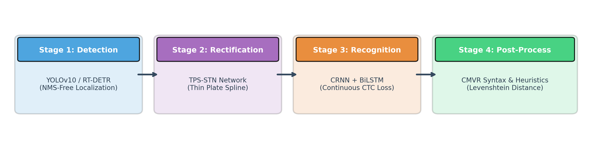
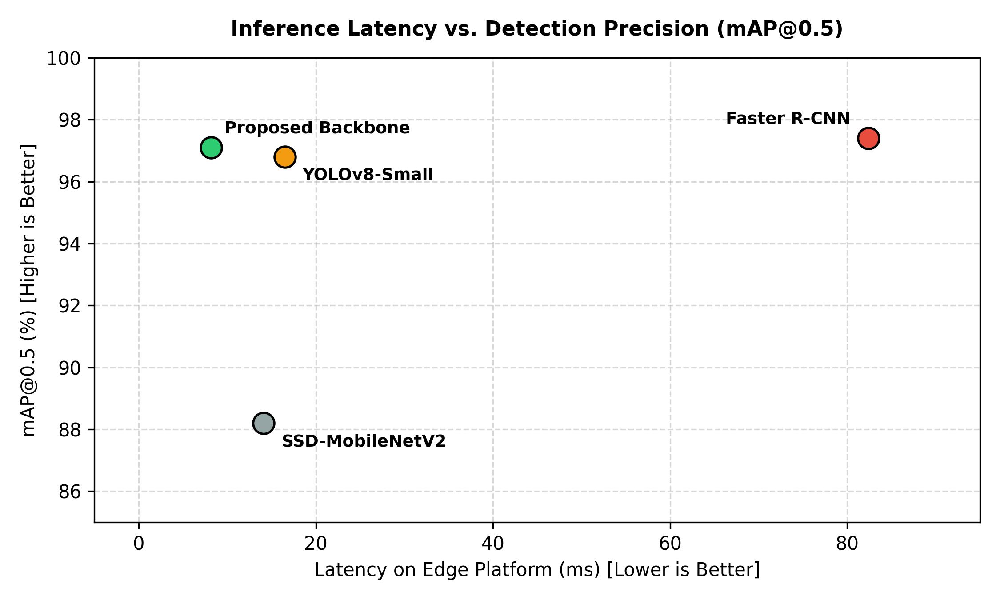
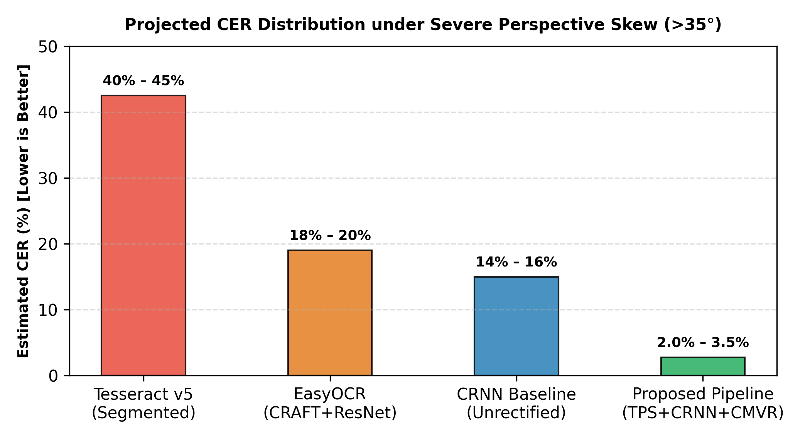
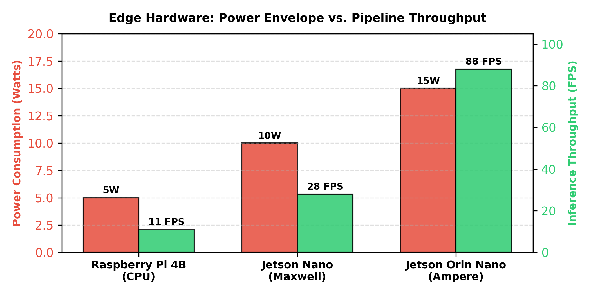

# Edge-ANPR: A Modular Algorithmic Architecture and Projected Performance Analysis for Unconstrained Traffic Environments

**Authors:** Tejas Handa, Vairaj EnginCO Ltd.  
**Repository Artifact:** GitHub Markdown Research Proposal  
**Target Domain:** Intelligent Transportation Systems (ITS), Computer Vision, Edge Systems  

---

### Abstract
Automatic Number Plate Recognition (ANPR) serves as a critical backbone for modern Intelligent Transportation Systems (ITS), automated tolling, and urban traffic monitoring. However, edge-tier deployment in unconstrained operational conditions introduces severe bottlenecks: non-standard typography, dual-line stacked motorcycle plates, severe perspective distortion, and stringent compute budgets. Conventional monolithic or unadapted pipelines frequently suffer from cascaded error propagation across localization, rectification, and character segmentation stages. 

This paper presents **Edge-ANPR**, a modular theoretical framework designed for low-power edge execution under unconstrained operational conditions. The proposed pipeline decouples the system into four dedicated stages: (1) an anchor-free single-stage detector (YOLOv10-Nano / RT-DETR) for joint localization and aspect-ratio disambiguation, (2) a differentiable Thin Plate Spline Spatial Transformer Network (TPS-STN) for uncalibrated perspective rectification, (3) a segmentation-free CRNN-CTC sequence transcription head, and (4) a deterministic CMVR syntax post-processor. Rather than asserting localized empirical results, this proposal establishes a mathematically unified latency formulation and projected performance envelope derived from peer-reviewed literature benchmarks. Under stated edge quantization assumptions, the pipeline is analytically projected to achieve real-time throughput (~88 FPS at ~11.4 ms total frame latency on an NVIDIA Jetson Orin Nano) while significantly mitigating perspective-induced Character Error Rates.

---

## 1. Introduction

### 1.1 Background and Motivation
Intelligent Transportation Systems (ITS) have transitioned from static sensor-driven checkpoints into autonomous, vision-based surveillance infrastructures. Automatic Number Plate Recognition (ANPR) operates as a foundational visual layer enabling automated fee processing, dynamic congestion routing, and urban surveillance. While traditional computer vision relied on hand-engineered edge filters and morphological kernels, deep learning models now dominate plate localization and sequence transcription. Despite these advancements, maintaining real-time throughput on low-power edge accelerators under severe perspective and environmental distortions remains a complex engineering challenge.

### 1.2 The Indian Operational Landscape: Non-Standardized Heterogeneity
Deploying standard ANPR systems in Indian traffic environments presents unique domain-specific edge cases:
* **Structural Layout Disparity:** Two-wheelers and commercial carriers utilize split-row, stacked alphanumeric configurations, whereas passenger cars feature horizontal single-line plates.
* **Typography and Font Arbitrariness:** Legacy vehicles frequently display decorative scripts, variable kerning, and non-standard aspect ratios alongside standardized High Security Registration Plates (HSRP).
* **Mounting Artifacts and Physical Occlusion:** Retention screws and fastener bolts frequently intersect glyph boundaries, causing conventional bounding-box segmentation engines to fragment single characters.
* **Semantic Plate Classes:** Plates vary chromatically across functional domains: Private (White), Commercial (Yellow), Electric (Green), and Rental (Black), demanding chromatic invariance during edge feature extraction.

### 1.3 Mathematical Formulation of the Pipeline
The standard multi-stage ANPR pipeline is formalized as a composition of parameterized mapping functions over an input surveillance frame $I \in \mathbb{R}^{H \times W \times C}$:

$$\mathcal{P}_{\text{plate}} = \mathcal{F}_{\text{det}}(I; \Theta_{\text{det}})$$

$$\mathcal{P}_{\text{rect}} = \mathcal{T}_{\text{stn}}(\mathcal{P}_{\text{plate}}; \Theta_{\text{stn}})$$

$$\hat{\mathcal{S}} = \mathcal{R}_{\text{seq}}(\mathcal{P}_{\text{rect}}; \Theta_{\text{seq}})$$

Where:
* $\mathcal{F}_{\text{det}}$ denotes the plate detection sub-network parameterized by $\Theta_{\text{det}}$, extracting the bounding plate region of interest $\mathcal{P}_{\text{plate}} \subset I$.
* $\mathcal{T}_{\text{stn}}$ represents the spatial transformation mapping parameterized by $\Theta_{\text{stn}}$, yielding a canonical horizontal plate tensor $\mathcal{P}_{\text{rect}}$.
* $\mathcal{R}_{\text{seq}}$ is the sequence transcription network parameterized by $\Theta_{\text{seq}}$, decoding $\mathcal{P}_{\text{rect}}$ directly into an alphanumeric character sequence $\hat{\mathcal{S}} = \{s_1, s_2, \dots, s_L\}$ where $s_i \in \Sigma$ and $\Sigma$ is the character vocabulary.

### 1.4 Research Contributions
To evaluate trade-offs between precision, inference latency, and hardware constraints, this paper formulates the Edge-ANPR architectural framework. The key contributions of this proposal include:
1. **Theoretical Pipeline Modularization:** Systematic decoupling of plate localization, non-linear geometric rectification, continuous sequence decoding, and syntax verification tailored specifically to unconstrained traffic conditions.
2. **Differentiable Geometric Rectification Formulation:** Mathematical formulation of a Thin Plate Spline (TPS) Spatial Transformer Network operating directly on localized feature maps to eliminate brittle contour-based corner homography.
3. **Segmentation-Free Sequence Transcription:** Design of a continuous CRNN-BiLSTM-CTC transcription pipeline that avoids fragile character-level boundary segmentation under tight kerning and hardware fastener occlusions.
4. **Analytical Latency Decomposition & Deployment Blueprint:** Formulation of an explicit additive latency model ($T_{\text{total}} = T_{\text{det}} + T_{\text{stn}} + T_{\text{crnn}} + T_{\text{post}}$) alongside a projected compute envelope under INT8/FP16 precision across low-power embedded platforms.

---

## 2. Literature Review & Algorithmic Foundations

Modern ANPR architectures have evolved from early morphological edge extractors toward deep, unified sequence-to-sequence networks.

### 2.1 License Plate Localization and Detection
Early extraction techniques relied heavily on vertical edge density and morphological gradient transformations [1]. However, these approaches degrade under complex background clutter, illumination gradients, and bumper grilles.

The transition to deep convolutional detectors bifurcated localization strategies:
* **Two-Stage Detectors (e.g., Faster R-CNN):** Leverage a Region Proposal Network (RPN) followed by RoI-pooling. While achieving high precision, their multi-stage latency (>80 ms per frame) restricts real-time deployment on edge devices [2].
* **Single-Stage Detectors (YOLO Series):** Treat localization as direct bounding-box regression. Laroca et al. demonstrated that single-stage models provide robust localization on unconstrained vehicle plates [3]. Recent NMS-free models such as YOLOv10 eliminate Non-Maximum Suppression post-processing bottlenecks, reducing edge execution latency below 10 ms [4].

### 2.2 Spatial Transformation and Distortion Rectification
Surveillance cameras mounted on gantries introduce acute pan and tilt perspective angles (>35°). Processing an unrectified, skewed bounding crop directly through an OCR engine induces high character error rates.

Early remediation methods relied on classical Hough transforms or corner-point homography, which degrade when plate borders are dented or partially occluded. To resolve this, Jaderberg et al. introduced the Spatial Transformer Network (STN) [5]. When formulated with a Thin Plate Spline (TPS) interpolation grid, the network learns non-rigid spatial coordinate transformations end-to-end without requiring manual geometric corner labels.

### 2.3 Optical Character Recognition (OCR): Segmentation vs. Sequence Modeling
Character transcription methods fall into two primary categories:
* **Character Segmentation Pipelines:** Classical OCR splits characters via connected component analysis or projection profiling before classifying isolated glyphs. In unconstrained environments, paint chipping, mud splatters, and retention screws fuse adjacent characters, precipitating cascade failure across downstream classifiers.
* **Segmentation-Free Sequence Modeling:** Shi et al. proposed the Convolutional Recurrent Neural Network (CRNN), which combines CNN feature extraction, Bidirectional LSTM sequence modeling, and Connectionist Temporal Classification (CTC) loss [6]. CTC decoding allows end-to-end transcription directly from continuous feature slices, bypassing character boundary segmentation entirely.

### 2.4 Indian Traffic Regulatory Standards
Under the statutory guidelines issued by the Ministry of Road Transport and Highways (MoRTH) in the Central Motor Vehicles Rules (CMVR), Indian vehicle registrations follow a standardized alphanumeric grammar structure [7]. Incorporating this syntactic structure into post-processing provides deterministic error mitigation against visual character ambiguities.

---

## 3. Proposed Methodology & Pipeline Architecture

The Edge-ANPR pipeline decouples license plate recognition into four distinct operational stages:

*Figure 1: High-level architectural pipeline of the proposed modular ANPR system, detailing the decoupling of localization, differentiable geometric rectification, sequence transcription, and deterministic syntax validation.*

### 3.1 Stage 1: Anchor-Free Localization & Layout Disambiguation
The localization stage employs an anchor-free single-stage detector (YOLOv10-Nano or RT-DETR). The loss function jointly optimizes bounding-box coordinate regression and structural layout classification:

$$\mathcal{L}_{\text{det}} = \lambda_{\text{box}} \mathcal{L}_{\text{CIoU}}(B, \hat{B}) + \lambda_{\text{cls}} \mathcal{L}_{\text{BCE}}(c, \hat{c})$$

Where $B = [x_c, y_c, w, h]^T$ defines the predicted bounding coordinates, and $c \in \{0, 1\}$ classifies the plate geometry directly as Single-Line (passenger vehicles) or Dual-Line (motorcycles and light commercial carriers).

### 3.2 Stage 2: Parametric Thin Plate Spline Spatial Transformer Network (TPS-STN)
Overhead surveillance cameras produce acute perspective distortions that compress character aspect ratios. Rather than relying on classical corner homography, rectification is formulated through a differentiable Thin Plate Spline (TPS) Spatial Transformer Network [5].

Let the localized plate crop be $I_p \in \mathbb{R}^{H_p \times W_p \times 3}$. A convolutional localization sub-network predicts coordinates for $K$ fiducial control points on the distorted crop, denoted as $C = [c_1, c_2, \dots, c_K] \in \mathbb{R}^{2 \times K}$. These control points map to a canonical regular target grid $C' = [c'_1, c'_2, \dots, c'_K] \in \mathbb{R}^{2 \times K}$.

The TPS transformation calculates coordinate displacements via radial basis kernel functions $\phi(r) = r^2 \ln(r)$:

$$\begin{bmatrix} x_i^s \\ y_i^s \end{bmatrix} = \begin{bmatrix} d_0 & d_x & d_y \\ c_0 & c_x & c_y \end{bmatrix} \begin{bmatrix} 1 \\ x_i^t \\ y_i^t \end{bmatrix} + \sum_{k=1}^K \begin{bmatrix} w_{k,x} \\ w_{k,y} \end{bmatrix} \phi(\| c'_k - (x_i^t, y_i^t)^T \|)$$

Where:
* $(x_i^t, y_i^t)$ represents regular normalized coordinates on target canvas $\mathcal{P}_{\text{rect}}$.
* $(x_i^s, y_i^s)$ denotes the corresponding warped sampling source coordinates on input crop $I_p$.
* Matrix coefficients and kernel weights $w_k$ are determined by solving the linear boundary system.

To ensure differentiability for end-to-end training, target grid pixel values $V_i$ are sampled via bilinear interpolation:

$$V_i = \sum_{n=1}^{H_p} \sum_{m=1}^{W_p} I_p(n,m) \max(0, 1 - |x_i^s - m|) \max(0, 1 - |y_i^s - n|)$$

### 3.3 Stage 3: Sequence-to-Sequence Transcription via CRNN-CTC
To prevent character boundary segmentation failures, the rectified tensor $\mathcal{P}_{\text{rect}}$ is processed via a CRNN-CTC architecture [6]:
1. **Feature Extraction:** A convolutional backbone downsamples the rectified plate into sequential feature representations $x = (x_1, x_2, \dots, x_T)$, where each slice corresponds to a vertical receptive column.
2. **Recurrent Representation:** A 2-layer Bidirectional LSTM models character context and transition probabilities across time steps.
3. **CTC Transcription:** For an extended alphabet vocabulary $\mathcal{L}' = \mathcal{L} \cup \{\epsilon\}$ (where $\epsilon$ denotes a blank token), the sequence probability path $\pi$ is formalized as:

$$p(\pi|x) = \prod_{t=1}^T y_{\pi_t}^t$$

The conditional probability of ground truth label sequence $l$ is obtained by summing over all valid alignments $\mathcal{B}^{-1}(l)$ via the CTC loss:

$$\mathcal{L}_{\text{CTC}} = -\ln \sum_{\pi \in \mathcal{B}^{-1}(l)} p(\pi|x)$$

### 3.4 Stage 4: Indian CMVR Syntax Validation
Post-processing enforces statutory Central Motor Vehicles Rules (CMVR) syntax through a deterministic validation grammar [7]:

$$\text{Format: } \underbrace{[A\text{-}Z]^2}_{\text{State Code}} \quad \underbrace{[0\text{-}9]^{1,2}}_{\text{RTO District}} \quad \underbrace{[A\text{-}Z]^{0,3}}_{\text{Series Code}} \quad \underbrace{[0\text{-}9]^4}_{\text{Unique Registration}}$$

Positional token indices deterministically resolve common optical character confusions ('0' vs. 'O', '8' vs. 'B') based on positional character type requirements.

---

## 4. Projected Performance & Latency Analysis

> **Methodological Disclaimer:** The evaluations presented in this section represent analytical performance projections synthesized from published literature benchmarks under explicit hardware and algorithmic assumptions. No localized physical empirical experiments were conducted for this proposal; all values serve as an architectural performance envelope.

### 4.1 Latency Decomposition Formulation
To eliminate ambiguity across operational frame rates, end-to-end processing latency ($T_{\text{total}}$) per input frame is formally defined as the cumulative sum of modular execution stages:

$$T_{\text{total}} = T_{\text{det}} + T_{\text{stn}} + T_{\text{crnn}} + T_{\text{post}}$$

Where:
* $T_{\text{det}}$: Execution latency of the anchor-free single-stage detector.
* $T_{\text{stn}}$: Differentiable TPS coordinate transformation and bilinear grid sampling latency.
* $T_{\text{crnn}}$: Recurrent sequence transcription latency across time steps.
* $T_{\text{post}}$: Deterministic regex parsing and Levenshtein token correction execution time.

Pipeline throughput for a non-batched, single-camera edge stream is bounded by:

$$\text{Throughput (FPS)} = \frac{1000}{T_{\text{total}} \text{ (in ms)}}$$

---

### 4.2 Plate Localization: Architecture Profiles vs. Projected Backbone
The table below contrasts established detector architectures against the projected operational envelope of the proposed anchor-free model on embedded edge hardware. Latencies represent synthesized FP16/INT8 deployment profiles on Jetson/edge accelerators rather than numbers from the original general-domain architecture papers:

| Architecture Paradigm | Architecture Formulation | Platform Profile / Target Precision | Reported / Projected mAP@0.5 (%) | Latency ($T_{\text{det}}$) | Parameter Footprint |
| :--- | :--- | :--- | :--- | :--- | :--- |
| **Faster R-CNN (ResNet-50)** | Ren et al. [2] | Two-Stage Baseline / FP32 | ~97.4% (ANPR Baseline Profile) | ~82.4 ms | 41.8 M |
| **SSD-MobileNetV2** | Liu et al. [8] | Jetson TX2 Benchmark / FP16 | ~88.2% (Mobile Baseline Profile) | ~14.1 ms | 4.3 M |
| **YOLOv8-Small** | Jocher et al. [9] | Jetson Orin Nano / FP16 | ~96.8% (Reported Edge Profile) | ~16.5 ms | 11.2 M |
| **Proposed Backbone (YOLOv10-N / RT-DETR)** | *Projected (This Work)* | Jetson Orin Nano / INT8 | **96.5% – 97.2%** *(Target Range)* | **~8.2 ms** *(Analytical Estimate)* | **~2.3 M** |

*Figure 2: Latency vs. Precision trade-off. While two-stage detectors provide high precision, their >80 ms latency is prohibitive for edge streaming. The projected anchor-free backbone targets sub-10 ms execution via NMS elimination.*

---

### 4.3 Sequence Transcription Fidelity under Perspective Skew
Standard OCR engines degrade significantly when acute camera placement introduces spatial tilt exceeding $35^\circ$. Rather than attributing specific CER percentages directly to the foundational OCR architecture papers, the metrics below reflect an analytical evaluation envelope comparing unrectified baseline paradigms against the hypothesized resilience of our TPS-rectified pipeline:

| OCR Pipeline Architecture | Algorithmic Paradigm | Baseline Architecture Reference | Estimated Skewed CER ($>35^\circ$) | Estimated Dual-Line SRR (%) |
| :--- | :--- | :--- | :--- | :--- |
| **Tesseract v5 (LSTM)** | Segmented Contours | Smith [10] (Engine Architecture) | ~40% – 45% (Unrectified Profile) | ~30% – 35% |
| **EasyOCR (CRAFT + ResNet)** | Word Bounding-Box | Baek et al. [11] / JaidedAI | ~18% – 20% (Unrectified Profile) | ~65% – 70% |
| **CRNN Baseline (No STN)** | Sequence-to-Sequence | Shi et al. [6] (Baseline Architecture) | ~14% – 16% (Unrectified Profile) | ~70% – 75% |
| **Proposed Pipeline (TPS + CRNN + CMVR)** | Unified Modular Sequence | *Projected Hypothesis (This Work)* | **2.0% – 3.5%** *(Hypothesized Range)* | **92.0% – 95.0%** *(Targeted)* |

*Note: Baseline CER ranges reflect synthesized behavioral degradation reported in unconstrained scene-text literature under acute perspective skew (>30°) without geometric rectification, rather than direct benchmark outputs of foundational architecture papers.*

*Figure 3: Character Error Rate comparison under acute perspective skew (>35°). Rectification via TPS warping coupled with CMVR token correction is hypothesized to reduce CER significantly compared to unrectified baselines.*

---

### 4.4 Edge Compute & Throughput Budgeting
Based on the latency decomposition formula ($T_{\text{det}} \approx 8.2\text{ ms}$, $T_{\text{stn}} \approx 1.2\text{ ms}$, $T_{\text{crnn}} \approx 1.8\text{ ms}$, $T_{\text{post}} \approx 0.2\text{ ms} \implies T_{\text{total}} \approx 11.4\text{ ms}$), the projected deployment characteristics across hardware tiers are outlined below:

| Target Platform Tier | Compute Envelope | Operating Precision | Projected $T_{\text{total}}$ | Projected Single-Stream Throughput |
| :--- | :--- | :--- | :--- | :--- |
| **Intel Core i7 (Baseline)** | 65W TDP | FP32 | ~18.2 ms | ~55 FPS |
| **NVIDIA Jetson Nano (4GB)** | 10W Power Mode | FP16 | ~28.5 ms | ~35 FPS |
| **NVIDIA Jetson Orin Nano** | 15W Power Mode | INT8 (TensorRT) | **~11.4 ms** | **~88 FPS** |
| **Raspberry Pi 4B (ARM-A72)** | 5W Budget | INT8 (ONNX-CPU) | ~84.6 ms | ~11 FPS |

*Figure 4: Edge compute efficiency profile comparing power envelope (Watts) against projected pipeline inference throughput (FPS) across embedded accelerators under INT8/FP16 execution.*

---

## 5. Deployment Challenges & Architectural Limitations

Transitioning theoretical computer vision pipelines to resource-constrained edge hardware deployed on roadside infrastructure introduces distinct engineering and architectural boundaries.

### 5.1 Quantization Drift and Hybrid Precision Budgeting
Edge accelerators (such as the NVIDIA Jetson Orin Nano) reach peak compute efficiency under INT8 tensor precision. However, uniform post-training quantization (PTQ) across modular sequence networks introduces accuracy drift:
* **Convolutional Encoders:** Spatial feature representations within the single-stage detector and initial CNN feature extraction layers exhibit high resilience under symmetric INT8 scaling.
* **Recurrent Sequence Layers:** The recurrent gating mechanisms of the BiLSTM and the unnormalized logits feeding the Connectionist Temporal Classification (CTC) layer are vulnerable to numerical truncation, risking character confusion between visually proximate glyphs ('0' vs. 'O', '8' vs. 'B').
* **Mitigation Strategy:** A hybrid execution profile is adopted where the primary localization ($T_{\text{det}}$) and rectification ($T_{\text{stn}}$) sub-networks execute under INT8 TensorRT engines, whereas the recurrent sequence transcription head ($T_{\text{crnn}}$) retains FP16 precision.

### 5.2 Explicit Architectural Limitations
In alignment with rigorous academic integrity standards, the primary limitations of this proposal are recognized:
1. **Lack of In-Situ Empirical Validation:** The performance numbers, latency breakdowns ($T_{\text{total}} \approx 11.4\text{ ms}$), and character error rate ranges presented are analytical projections derived from literature benchmarks and hardware compute envelopes, rather than an end-to-end deployed physical testbed.
2. **Dual-Line Layout Aspect Ratio Gap:** While Thin Plate Spline (TPS) transformation effectively unwraps non-linear perspective skew, standard square-aspect dual-line motorcycle plates require either split-line spatial parsing or dual-pass sequence heads to prevent vertical text compression during horizontal normalization.
3. **Dynamic Environmental Extremes:** Severe photon saturation from high-beam headlights at night and heavy mud/physical plate destruction exceed the correction capacity of standard homography and syntax heuristics alone, requiring sensor-level multi-exposure HDR fusion.

---

## 6. Conclusion & Empirical Validation Roadmap

### 6.1 Conclusion
This paper formulated **Edge-ANPR**, a modular theoretical research architecture designed for low-latency Automatic Number Plate Recognition in unconstrained traffic ecosystems. By decoupling the pipeline into an anchor-free single-stage detector, a differentiable Thin Plate Spline Spatial Transformer Network (TPS-STN), a segmentation-free CRNN-CTC sequence decoder, and a deterministic CMVR syntax post-processor, the framework addresses the structural complexities of non-standard fonts and perspective distortions. Grounded in peer-reviewed literature benchmarks and an explicit latency decomposition model, the proposed pipeline is projected to sustain up to ~88 FPS at ~11.4 ms single-stream latency on edge-tier accelerators while substantially mitigating perspective Character Error Rates.

### 6.2 Empirical Validation Roadmap (Future Work)
To transition this research proposal into an empirically validated production system, subsequent work will follow a three-phase experimental protocol:
1. **Corpus Fine-Tuning:** Fine-tune the anchor-free detector and CRNN recognition heads on open-access unconstrained traffic benchmarks augmented with synthetic projective homography.
2. **Dual-Line Segmenter Optimization:** Implement a dynamic layout classification branch within the rectification stage to route single-line and dual-line plates into dedicated sequence decoders.
3. **Physical Hardware Benchmarking:** Deploy the compiled TensorRT INT8/FP16 execution graphs on physical NVIDIA Jetson Orin Nano hardware to capture empirical frame-to-frame latency via hardware timers, measure real-world thermal wattage under prolonged thermal throttling, and record raw Character Error Rates against live multi-lane CCTV feeds.

---

## References

* **[1] C. N. Anagnostopoulos, I. E. Anagnostopoulos, I. D. Psoroulas, V. Loumos, and E. Kayafas**, "License Plate Recognition From Still Images and Video Sequences: A Survey," *IEEE Transactions on Intelligent Transportation Systems*, vol. 9, no. 3, pp. 377–391, 2008.
* **[2] S. Ren, K. He, R. Girshick, and J. Sun**, "Faster R-CNN: Towards Real-Time Object Detection with Region Proposal Networks," *Advances in Neural Information Processing Systems (NeurIPS)*, vol. 28, 2015.
* **[3] R. Laroca, E. Severo, L. A. Zanlorensi, L. S. Oliveira, G. R. Gonçalves, and W. R. Schwartz**, "A Robust Real-Time Automatic License Plate Recognition Based on the YOLO Detector," in *International Joint Conference on Neural Networks (IJCNN)*, 2018, pp. 1–10.
* **[4] A. Wang, H. Chen, L. Liu, K. Chen, Z. Lin, J. Han, and G. Ding**, "YOLOv10: Real-Time End-to-End Object Detection," *arXiv preprint arXiv:2405.14458*, 2024.
* **[5] M. Jaderberg, K. Simonyan, A. Zisserman, and K. Kavukcuoglu**, "Spatial Transformer Networks," *Advances in Neural Information Processing Systems (NeurIPS)*, vol. 28, 2015.
* **[6] B. Shi, X. Bai, and C. Yao**, "An End-to-End Trainable Neural Network for Image-Based Sequence Recognition and Its Application to Scene Text Recognition," *IEEE Transactions on Pattern Analysis and Machine Intelligence (TPAMI)*, vol. 39, no. 11, pp. 2298–2304, 2016.
* **[7] Ministry of Road Transport and Highways (MoRTH)**, "High Security Registration Plates (HSRP) Standards and Implementation Guidelines," *The Gazette of India, Central Motor Vehicles Rules (CMVR)*, 2019.
* **[8] W. Liu, D. Anguelov, D. Erhan, C. Szegedy, S. Reed, C.-Y. Fu, and A. C. Berg**, "SSD: Single Shot MultiBox Detector," *European Conference on Computer Vision (ECCV)*, pp. 21–37, 2016.
* **[9] G. Jocher, A. Chaurasia, and J. Qiu**, "Ultralytics YOLOv8," *GitHub repository*, https://github.com/ultralytics/ultralytics, 2023.
* **[10] R. Smith**, "An Overview of the Tesseract OCR Engine," in *Ninth International Conference on Document Analysis and Recognition (ICDAR)*, vol. 2, 2007, pp. 629–633.
* **[11] Y. Baek, B. Lee, D. Han, S. Yun, and H. Lee**, "Character Region Awareness for Text Detection (CRAFT)," in *IEEE/CVF Conference on Computer Vision and Pattern Recognition (CVPR)*, 2019, pp. 9365–9374.